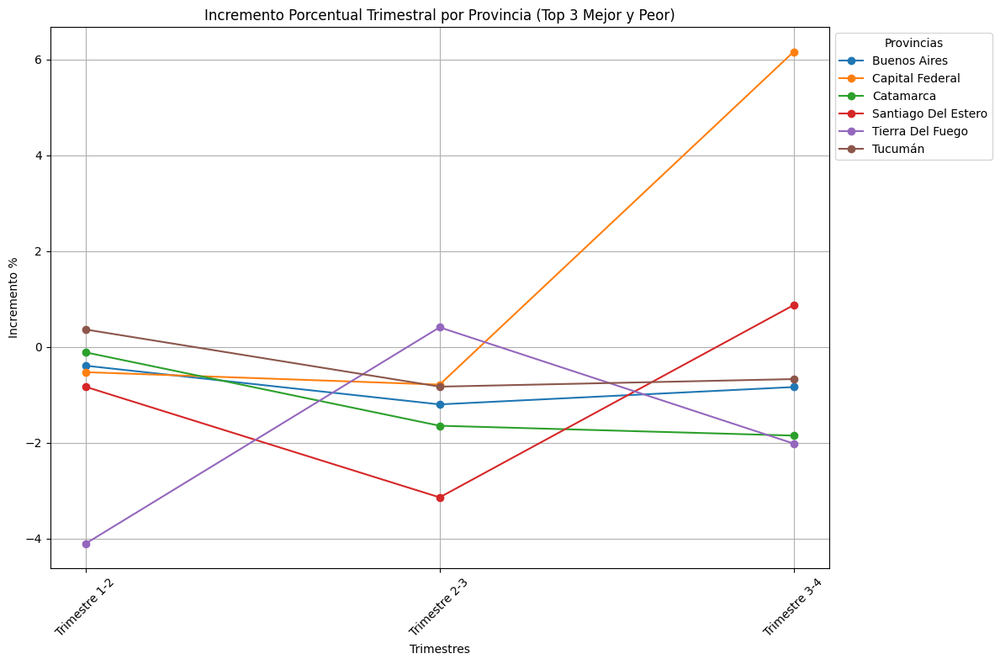
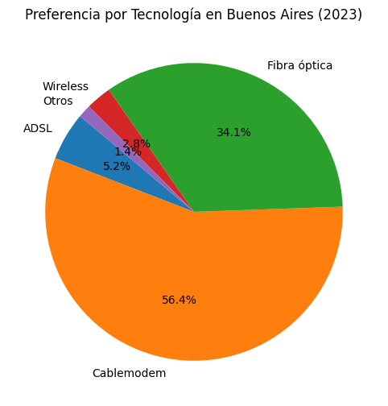
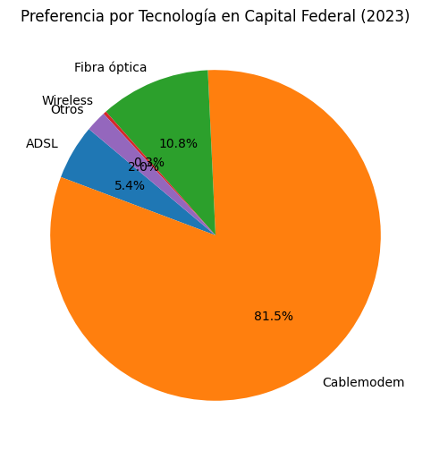
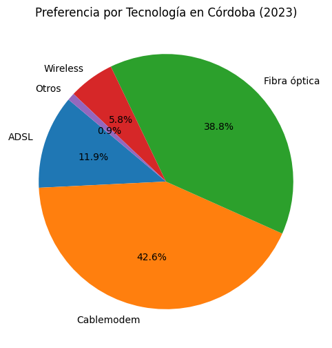

# 📊 PI2_Telecomunicaciones
## Proyecto Individual No. 2 - EDA y Dashboard del Contexto General del Internet en Argentina
### 👤 JUAN CAMILO CANDELA COL

## 🌍 Análisis de Preferencias por Tecnología en Provincias de Argentina (2023)
Este proyecto presenta un análisis exploratorio de datos (EDA) y visualización de las preferencias tecnológicas en distintas provincias de Argentina durante el año 2023. El enfoque principal está en las tres provincias con el mayor número de accesos a internet, mostrando la distribución de las tecnologías utilizadas en cada una de ellas.

## 📑 Contenido

📜 Introducción

🎯 Objetivos

🛠️ Metodología

📈 Resultados

📝 Conclusiones

🗂️ Estructura del Proyecto

💡 Contribuciones

## 🌟 Introducción
En el contexto del crecimiento y la diversificación de las tecnologías de acceso a internet, es crucial entender cómo se distribuyen estas tecnologías en diferentes regiones. Este análisis se centra en identificar las preferencias tecnológicas en las provincias con mayor número de accesos en Argentina durante 2023.

## 🎯 Objetivos
  🔍 Analizar las preferencias tecnológicas de acceso a internet en las principales provincias de Argentina en 2023.
  
  📊 Visualizar la distribución de las tecnologías utilizadas en las tres provincias con más accesos totales.
  
  💼 Proporcionar información valiosa para la toma de decisiones en el sector de telecomunicaciones.
  
## 🛠️ Metodología
🗂️ Filtrado de Datos: Se seleccionaron los datos correspondientes al año 2023.

📌 Identificación de Provincias Principales: Se determinaron las tres provincias con el mayor número de accesos totales.

📊 Visualización: Se generaron gráficos de torta para cada una de las provincias seleccionadas, mostrando la proporción de cada tecnología.

## 📈 Resultados
### Ponderado de la variación del 2023
Garantizar un crecimiento sostenible en la penetración del acceso a internet en Argentina es crucial para cerrar la brecha entre áreas urbanas y rurales y asegurar que todos los sectores de la sociedad se beneficien equitativamente.

Un aumento temporal en la conectividad, seguido de un retroceso, no solo frena el desarrollo, sino que también afecta la confianza en las políticas públicas y las inversiones. Un acceso constante y en crecimiento es vital para impulsar la economía digital, crear empleo, y fomentar la inclusión social, elementos esenciales para el desarrollo socioeconómico del país.

📊 Linea de Porcentaje: Comportamiento de 6 Pronvicias durante el 2023

La mayoría de las provincias presentan variabilidad en los incrementos porcentuales a lo largo de los trimestres del 2023. Esta variabilidad puede deberse a cambios en la demanda de servicios, políticas gubernamentales, o fluctuaciones en la infraestructura y disponibilidad de servicios de telecomunicaciones. El análisis de los incrementos porcentuales trimestrales sugiere que mientras algunas provincias experimentan fluctuaciones significativas, otras muestran una tendencia más estable, ya sea en términos de crecimiento o decrecimiento. Estas variaciones pueden proporcionar información valiosa sobre el comportamiento del mercado y las necesidades de intervención para mejorar o estabilizar los servicios en ciertas áreas.

### Tendencia Negativa en Muchos Casos
Muchas provincias muestran decrementos en la mayoría de los trimestres, lo que sugiere una posible disminución en la penetración o uso de los servicios medidos en esos períodos.

Buenos Aires:
Muestra decrementos continuos en todos los trimestres, aunque no son tan pronunciados. Esto podría indicar una leve reducción en la adopción de los servicios, o una estabilización después de un período de crecimiento.

Capital Federal:
Tiene un comportamiento interesante, con una disminución en los primeros dos trimestres seguida de un incremento significativo en el tercer trimestre. Esto podría sugerir la implementación de nuevas tecnologías o promociones que incentivaron el uso de los servicios.

### Tecnologías implementadas de las Provincias con mayor registros

A continuación, se presentan los gráficos de torta que muestran la presencia por tecnología en cada una de las tres provincias seleccionadas:

📊 Gráfico 1: Presencia por Tecnología en Buenos Aires (2023)

📊 Gráfico 2: Presencia por Tecnología en Capital Federal (2023)

📊 Gráfico 3: Presencia por Tecnología en Cordoba (2023)

## 📝 Conclusiones
  📉 Distribución de Tecnologías: Cada provincia muestra una preferencia distinta por las tecnologías de acceso a   
     internet, lo que refleja las diferencias en infraestructura y accesibilidad.
  
  🔧 Implicaciones para la Industria: Estos resultados pueden ayudar a los proveedores de servicios a enfocar sus 
     esfuerzos en mejorar o expandir ciertas tecnologías en regiones específicas.
     
## 🗂️ Estructura del Proyecto
bash
Copiar código
├── 📁 data/
│   │
│   └── 📄 Internet.xlsx          
├── 📁 src/
│   │
│   └── 📄 EDA_NetArg.ipynb       
│
├── 📄 README.md                  

## 💡 Contribuciones
Las contribuciones son bienvenidas. Puedes abrir un issue para reportar un error o enviar un pull request para proponer mejoras.

